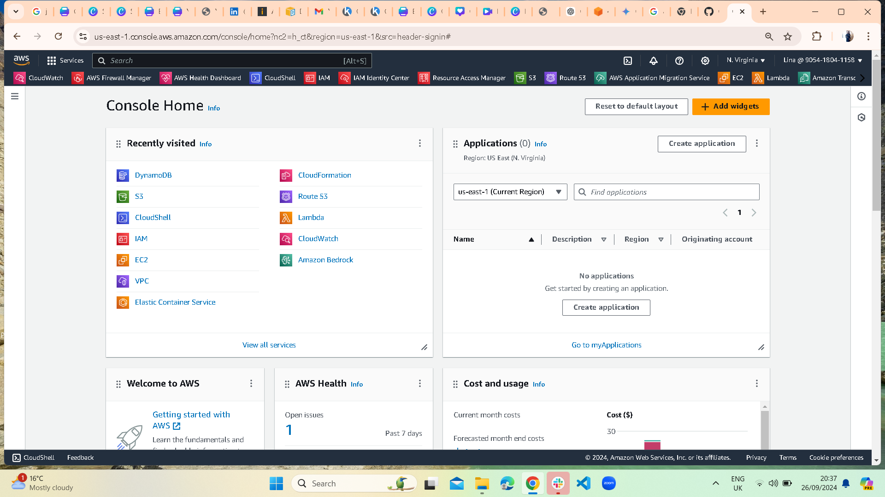
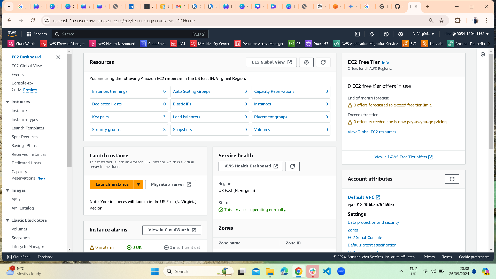

# Launching an EC2 Instance

This guide will walk you through launching an EC2 instance on AWS.

## Step 1: Go to the EC2 Dashboard
Navigate to the EC2 service from the AWS Management Console.

## Step 2: Launch an Instance
Click **Launch Instance**, and follow the steps to configure:
- **AMI**: Amazon Linux 2 (Free Tier Eligible)
- **Instance Type**: t2.micro
- **Key Pair**: Create or choose an existing key pair.

...

## Step 6: Connect to Your Instance
Once launched, connect to your instance using EC2 Instance Connect or your preferred method.

...
