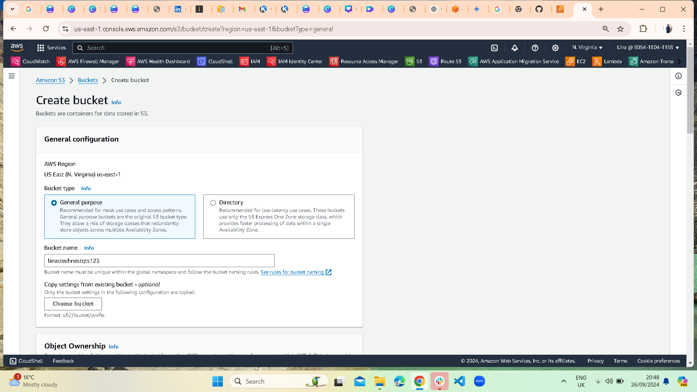
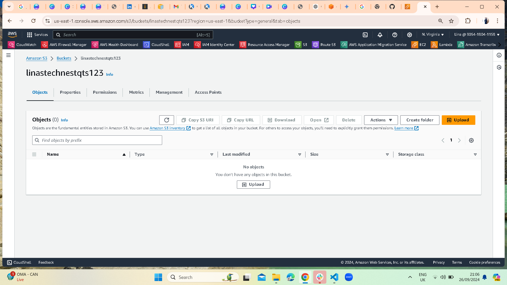

# Creating an S3 Bucket

This guide will show you how to create an S3 bucket on AWS.

## Step 1: Navigate to the S3 Service
In the AWS Console, search for S3 and open the S3 service.

## Step 2: Create a New Bucket
Click **Create Bucket** and enter the required details:
- **Bucket Name**: Unique name (e.g., cloudstart-static-site)
- **Region**: Choose the desired region.

...

## Step 6: Configure Bucket Permissions
Make the bucket public to allow for static website hosting by adjusting the permissions.

...
